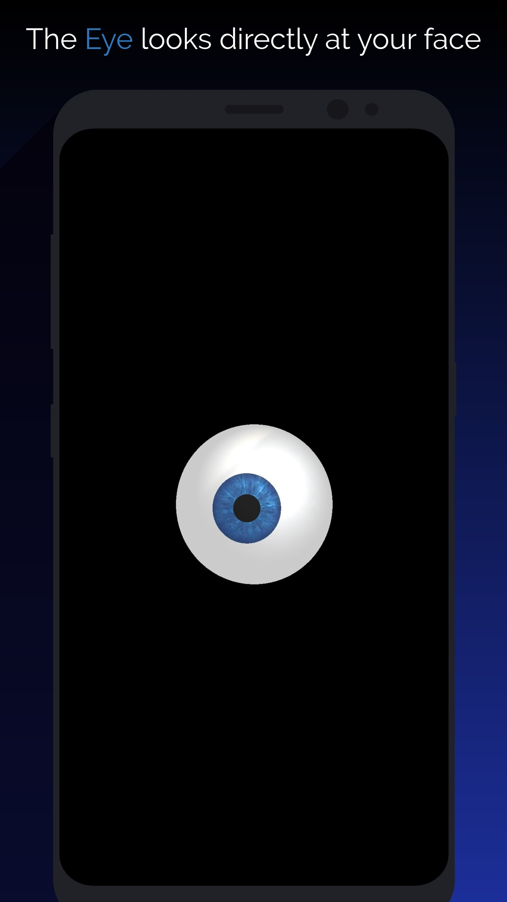

# Following eye
## [Blog post](https://ivanludvig.github.io/blog/2019/07/20/calculating-screen-to-face-distance-android.html)
### [Download APK](https://drive.google.com/file/d/1vCjdne36B7f3zUiusYlleMPq3h8IuFw7/view?usp=sharing)
Uses android's face detection and libgdx to render 3d eye model

